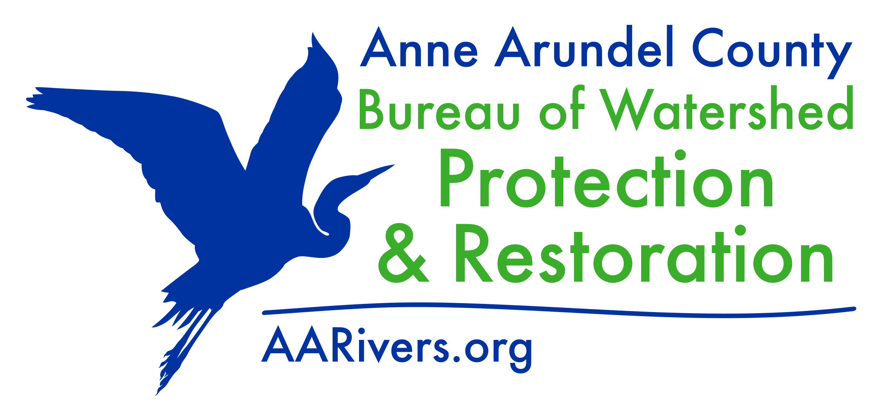

$$\\[1in]$$

```{r bwpr_logo_aarivers, echo=FALSE, out.width = '90%'}

```

\newpage

```{r setup, include=FALSE}
library(knitr)
library(tidyverse)
library(leaflet)
knitr::opts_chunk$set(echo = TRUE)
exist_streamtable <- nrow(params$streamtable)>0
exist_riptable <- nrow(params$riptable)>0 
exist_shoretable <- nrow(params$shoretable)>0
exist_retrotable <- nrow(params$retrotable)>0 
exist_ftwtable <- nrow(params$ftwtable)>0 
```

# Introduction 

Anne Arundel County's Bureau of Watershed Protection and Restoration (BWPR) developed the Restoration Estimator Tool to assist NGOs and others to explore restoration opportunities, and estimate potential impervious restoration credit and TMDL reductions resulting from project implementation. The tool is provided 'as is' without warranty of any kind, either expressed, implied, or statutory. The user assumes the entire risk as to quality and performance of the data from this tool. All credits were calculated following Maryland Department of the Environment's document *Accounting for Stormwater Wasteload Allocations and Impervious Acres Treated*. For more information, please visit <https://mde.maryland.gov/programs/Water/StormwaterManagementProgram/>. To learn more about BWPR and Anne Arundel County, please visit <https://http://aarivers.org/>. The following information provides further information on how impervious surface restoration and pollutant reductions were modeled. 

```{r stream text,echo=FALSE,eval=exist_streamtable,results='asis'}
cat("## Stream Restoration Modeling Methods") 

cat("\nThe effect of stream restoration was modeled within ~200-ft segments using LiDAR data collected in 2017 and 2020. The model computes the volume changes within a 40-ft buffer around the stream network.\n")

cat("\nTSS is calculated by converting the annual volume loss by a bulk density value of 87.5 lb per cu ft. Restoration efficiency is assumed to be 50%, and therefore, the amount of TSS credit is halved. TN and TP credit were calculated by multiplying the TSS credit, at 50% efficiency, by default rates outlined in the Chesapeake Bay Expert Panel guidance. These values were 2.28 and 1.05 lbs per ton for TN and TP, respectively.\n")

cat("\nOnly projects with Equivalent Impervious Area (EIA) treatment above 0.02 ac per linear foot for each 200-ft segment are displayed, as these are likely to be in need of restoration. The credit estimates from this tool only use Protocol 1, although these can be expected to provide the majority of the credit. The implementation of projects with Protocol 2, 3, and 4 will likely have a higher total credit.")
```

```{r rip text,echo=FALSE,eval=exist_riptable,results='asis'}
cat("## Riparian Planting Modeling Methods")

cat("\nThe effect of riparian plantings were modeled for areas within 100-ft of a perennial stream. Areas within the 100-ft buffer were selected if they were either owned by Anne Arundel County or its affiliates, within 100-year FEMA floodplain, or already under an Anne Arundel County drainage easement. Finally, 2020 County land use and 2007 Tree Canopy data were then used to remove forested areas, and the road edges feature class is use to remove road areas.")
```

```{r shst text,echo=FALSE,eval=exist_shoretable,results='asis'}
cat("## Shoreline Restoration Modeling Methods")

cat("\nThe effect of shoreline restoration was modeled within ~500-ft shoreline segments. The model uses the mean 'Recent Erosion Rate' from the DNR Coastal Atlas, the segment length, and the median (50th percentile) elevation within a 30-ft buffer to compute a volume loss.\n")

cat("\nTSS is calculated by converting the annual volume loss to a mass using a default bulk density value of 93.6 lb per cu-ft, and applying a sand reduction factor of 0.551. TN and TP credit were calculated by multiplying the mass of TSS by default rates outlined in the Chesapeake Bay Expert Panel guidance. These values were 0.000290 and 0.000205 lb per lb for TN and TP, respectively.\n")

cat("\nOnly projects with Equivalent Impervious Area (EIA) treatment above 0.04 ac per linear foot for each 500-ft segment are displayed, as these are likely to be in need of restoration. The credit estimates from this tool only use Protocol 1, although these can be expected to provide the majority of the credit. The implementation of projects with Protocol 2, 3, and 4 will likely have a higher total credit.")
```

```{r ur text,echo=FALSE,eval=exist_retrotable,results='asis'}
cat("## Upland Retrofits Modeling Methods")

cat('\nThe effect of retrofitting structural BMPs such as ponds, wetlands, and filtering systems were modeled. BMPs are selected where the current rainfall depth treated (Pe) is 0.5 inches or less, the date of construction was prior to 2015, and the drainage area is greater than 1 acre. The maximum retrofit opportunity is assumed to be 3 inches of rainfall depth treatment. The existing treatment credit was subtracted from potential retrofit credit.')
```

```{r ftw text,echo=FALSE,eval=exist_ftwtable,results='asis'}
cat("## Floating Treatment Wetlands Modeling Methods")

cat("\nThe effect of implementing floating treatment wetlands were modeled by selecting non-tidal ponds. Ponds were identified by selecting 'Open Water' polygons in the 2020 County Land Cover dataset. Ponds were retained if they were associated with County BMP records classified as being a wet pond type BMP. This tab allows the user to select the percentage of the pond wet surface area that will be covered by a floating treatment wetland using radio buttons, with the different levels of coverage affecting credited treatment and pollutant reductions.")
```

\newpage

# Project Summary

The total impervious restoration and TMDL credits available for the selected features are presented in Table 1.  


```{r sumtable,echo=FALSE}
kable(params$sumtable, caption = "Summary table of all Impervious Restoration and TMDL credits from selected features:",
      col.names = c("TN Reduction (lbs)","TP Reduction (lbs)","TSS Reduction (tons)","EIA (ac)"))
```


  Figure 1 shows the total impervious restoration and TMDL credits available by BMP type. 

```{r sumplot,echo=FALSE, fig.cap= "Pie chart of Impervious Restoration and TMDL credits by BMP type from selected feaures"}
params$sumplot
```

\newpage


```{r stream table,echo=FALSE,eval=exist_streamtable,results='asis'}
cat("# Estimated Stream Restoration Reductions")
cat("\nA summary of selected features can be found in the table below.")
kable(params$streamtable%>%
        mutate(SiteID = substr(SiteID, 6, nchar(SiteID)))%>%
        select(-c(TaxAccountIDs,OwnerNames,NumOwners)), caption = "Summary table of all Impervious Restoration and TMDL credits from selected stream restoration features:",
      col.names = c("Site ID", "TN Reduction (lbs)","TP Reduction (lbs)","TSS Reduction (tons)","EIA (ac)"))
cat("\nA summary of land owner information for selected features can be found in the table below.")
kable(params$streamtable%>%
        mutate(SiteID = substr(SiteID, 6, nchar(SiteID)))%>%
        select(c(SiteID,TaxAccountIDs,OwnerNames,NumOwners)), caption = "Summary table of land owner information for selected stream restoration features:",
      col.names = c("Site ID", "Tax Account ID(s)","Owner Name(s)","Number of Owners"))
```

\newpage

```{r riparian planting,echo=FALSE,eval=exist_riptable,results='asis'}
cat("# Estimated Riparian Planting Reductions") 
cat("\nA summary of selected features can be found in the table below.")
kable(params$riptable[,-c(2,3)]%>%
        mutate(SiteID.rip = substr(SiteID.rip, 4, nchar(SiteID.rip)))%>%
        select(-c(TaxAccountIDs,OwnerNames,NumOwners)), caption = "Summary table of all Impervious Restoration and TMDL credits from selected riparian planting features:",
      col.names = c("Site ID","TN Reduction (lbs)","TP Reduction (lbs)","TSS Reduction (tons)","EIA (ac)"))
cat("\nA summary of land owner information for selected features can be found in the table below.")
kable(params$riptable%>%
        mutate(SiteID.rip = substr(SiteID.rip, 4, nchar(SiteID.rip)))%>%
        select(c(SiteID.rip,TaxAccountIDs,OwnerNames,NumOwners)), caption = "Summary table of land owner information for selected riparian planting features:",
      col.names = c("Site ID", "Tax Account ID(s)","Owner Name(s)","Number of Owners"))
```

\newpage

```{r shoreline restoration,echo=FALSE,eval=exist_shoretable,results='asis'}
cat("# Estimated Shoreline Restoration Reductions") 
cat("\nA summary of selected features can be found in the table below.")
kable(params$shoretable%>%
        mutate(SiteID.shore= substr(SiteID.shore, 6, nchar(SiteID.shore)))%>%
        select(-c(TaxAccountIDs,OwnerNames,NumOwners)), caption = "Summary table of all Impervious Restoration and TMDL credits from selected shoreline restoration features:",
      col.names = c("Site ID", "TN Reduction (lbs)","TP Reduction (lbs)","TSS Reduction (tons)","EIA (ac)"))
cat("\nA summary of land owner information for selected features can be found in the table below.")
kable(params$shoretable%>%
        mutate(SiteID.shore = substr(SiteID.shore, 6, nchar(SiteID.shore)))%>%
        select(c(SiteID.shore,TaxAccountIDs,OwnerNames,NumOwners)), caption = "Summary table of land owner information for selected shoreline restoration features:",
      col.names = c("Site ID", "Tax Account ID(s)","Owner Name(s)","Number of Owners"))
```

\newpage

```{r upland retrofits,echo=FALSE,eval=exist_retrotable,results='asis'}
cat("# Estimated Upland Retrofit Reductions") 
cat("\nA summary of selected features can be found in the table below.")
kable(params$retrotable%>%
        mutate(SiteID= substr(SiteID, 13, nchar(SiteID)))%>%
        select(-c(TaxAccountIDs,OwnerNames,NumOwners)), caption = "Summary table of all Impervious Restoration and TMDL credits from selected upland retrofit features:",
      col.names = c("Site ID","BMP Type","Drainage Area (ac)","Impervious (%)", "TN Reduction (lbs)","TP Reduction (lbs)","TSS Reduction (tons)","EIA (ac)"))
cat("\nA summary of land owner information for selected features can be found in the table below.")
kable(params$retrotable%>%
        mutate(SiteID = substr(SiteID, 13, nchar(SiteID)))%>%
        select(c(SiteID,TaxAccountIDs,OwnerNames,NumOwners)), caption = "Summary table of land owner information for selected shoreline restoration features:",
      col.names = c("Site ID", "Tax Account ID(s)","Owner Name(s)","Number of Owners"))
```

\newpage

```{r floating treatment wetlands,echo=FALSE,eval=exist_ftwtable,results='asis'}
cat("# Estimated Floating Treatment Wetland Reductions") 
cat("\nA summary of selected features can be found in the table below.")
kable(params$ftwtable%>%
        mutate(SiteID.ftw=substr(SiteID.ftw, 5, nchar(SiteID.ftw)))%>%
        select(-c(TaxAccountIDs,OwnerNames,NumOwners)), caption = "Summary table of all Impervious Restoration and TMDL credits from selected floating treatment wetland features:",
      col.names = c("Site ID", "Pond Area (ac)","TN Reduction (lbs)","TP Reduction (lbs)","TSS Reduction (tons)","EIA (ac)"))
cat("\nA summary of land owner information for selected features can be found in the table below.")
kable(params$ftwtable%>%
        mutate(SiteID.ftw = substr(SiteID.ftw, 5, nchar(SiteID.ftw)))%>%
        select(c(SiteID.ftw,TaxAccountIDs,OwnerNames,NumOwners)), caption = "Summary table of land owner information for selected floating treatment wetland features:",
      col.names = c("Site ID", "Tax Account ID(s)","Owner Name(s)","Number of Owners"))
```